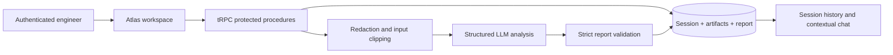

# CodeForge Atlas Architecture

## Design principle

Atlas is structured around a single rule: **do not turn uncertainty into a fact**. The server accepts an authenticated, focused source artifact and a proposed change intent. It produces a report whose schema separates direct evidence, assumptions to validate, map nodes and links, change impact, review items, documentation drafts, and test guidance.

| Layer | Responsibility |
|---|---|
| **Client** | Collects a source artifact and intent, renders reports, provides history and session chat. |
| **tRPC router** | Enforces authenticated procedure access and validates request shapes. |
| **Atlas engine** | Redacts common secrets, clips inputs, constructs prompts, and parses schema-constrained reports. |
| **Persistence** | Stores user-owned sessions, artifacts, reports, and messages for retrieval. |
| **LLM service** | Produces a constrained JSON analysis; it does not execute code or browse repositories. |

## Trust boundaries

The user-provided source is treated as untrusted content. It is never executed by Atlas. The report is a generated advisory artifact and must not be used as sole evidence for a production change. The UI tells users explicitly when information is inferred rather than supported by supplied artifacts.
